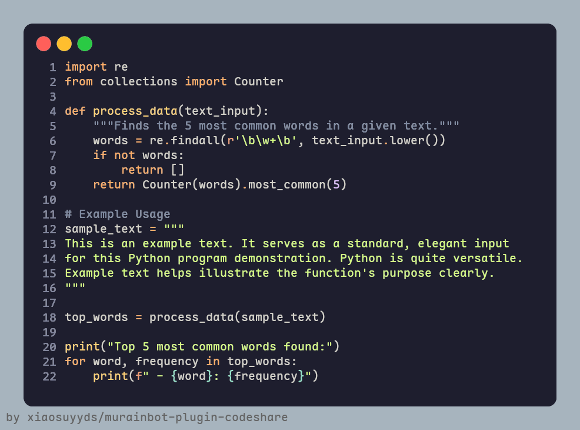

# murainbot-plugin-codeshare

***✨MuRainBot2插件，生成美丽的可供分享的代码图片✨***

## 安装

参考[MRB2文档](https://mrb2.xiaosu.icu/start/getting-started)

然后将本项目的CodeShare目录放在框架的 `plugins` 文件夹内

然后将本项目的 `data` 目录内的文件放在框架的 `data` 文件夹内

注：本项目的data目录并不包含emoji资源，请自行下载后放到框架的`data/emoji`文件夹内，下载地址：https://github.com/googlefonts/noto-emoji/tree/main/png
任选一种分辨率即可，直接将全部emoji文件放进`data/emoji`文件夹。

然后`python -m pip install -r /path/to/your/download/CodeShare/requirements.txt`
下载所需依赖库

最后运行MRB2即可

## 使用

支持两种命令
`/codeshare` `/cs`

两种用法:
 - 直接在命令后面跟上代码
 - 回复一条消息，然后跟上命令

## 配置项

首次启动会自动生成默认配置文件，位于/plugin_configs/CodeShare.yml

内有注释，照着改即可

## 许可证
版权所有 2025 Xiaosu。

根据 [Apache 2.0 许可证](https://github/xiaosuyyds/murainbot-plugin-codeshare/blob/master/LICENSE) 的条款分发。
